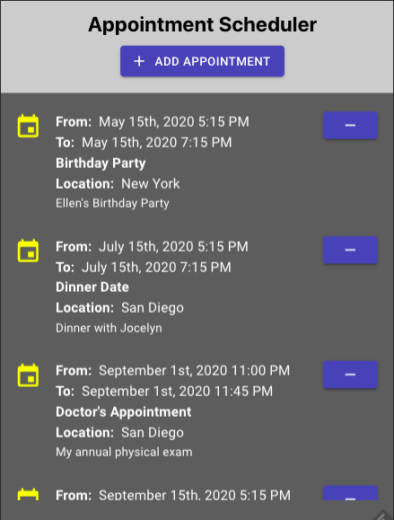
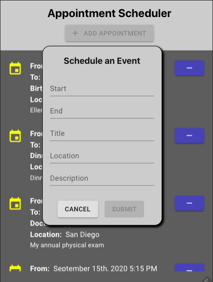
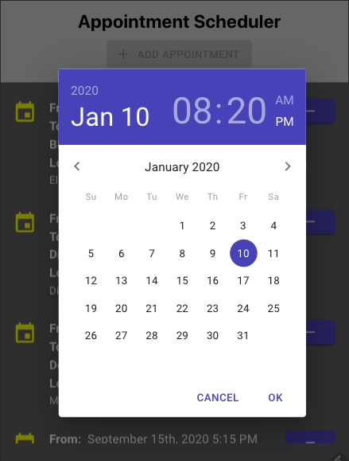
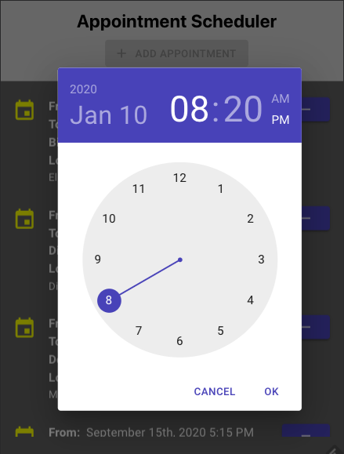

# Appointment Scheduler

A ReactJS app built by Keith Ratner

View live demo at https://kratner.github.io/react-appointment-scheduler

**Web:** https://keithratner.live

**E-Mail:** keith.ratner@gmail.com

**GitHub:** https://github.com/kratner

**LinkedIn:** https://www.linkedin.com/in/keithratner

---

## Instructions

Unzip package. In project folder, run:

`npm install`

then

`npm start`

View application at http://localhost:3000

Click **Add Appointment** to open the scheduling form.

Click on **Start** and **End** input fields to open the Date Picker...

... and Time Picker.

Sample data contains three records. All data modifications are volatile thus will not persist across sessions.

Note that this project uses Material UI libraries.

https://material-ui.com

---

&copy; Keith Ratner 2020
